Oversight process / I3
=======================
The I3 process is designed against the recommendations in [Ten Simple Rules for Reproducable Computational Research](https://doi.org/10.1371/journal.pcbi.1003285) in that each invididual stage is run though the I3 process as one unit. Each stage represents a series of inputs, outputs and has a desinated worker. While the user can specify the source files and the destination names, converstion should happen automatically within the I3 oversight process before it is passed onto the worker. This allows the workers themselves to concentrate on their domain areas - not needing to convert between difference reference formats for example.

In the Ten Simple Rules paper, the authors lay out that each stage should be tracked, manual intervention avoided and all steps should be version controlled. While the I3 implementation does not enforce this mandatorily, all of these recommendations are supported should the user require them.

I3 simplified flow
-------------------
The basic functionality of the I3 is as follows:

I3 detailed flow
-----------------
The following is a more detailed flow-chart for an I3 operation:

**Notes:**

* The workspace directory is typically a temporary directory created on disk
* During the Docker execution phrase - the worker may expose a web UI for the user to integrate with, if this happens the UI is proxied to the user with some method to 'finish' the process and continue on

---
[Back to contents](./README.md)
